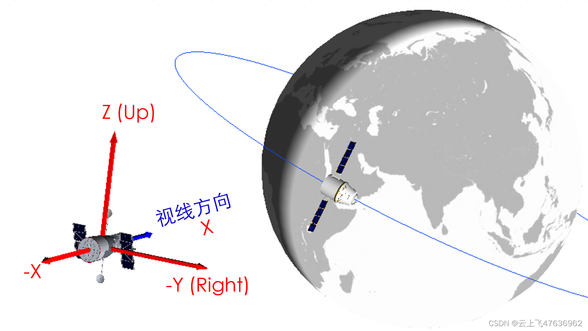
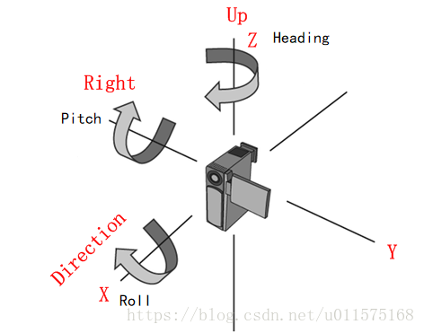
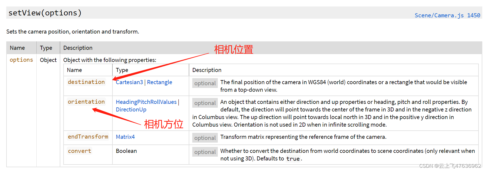
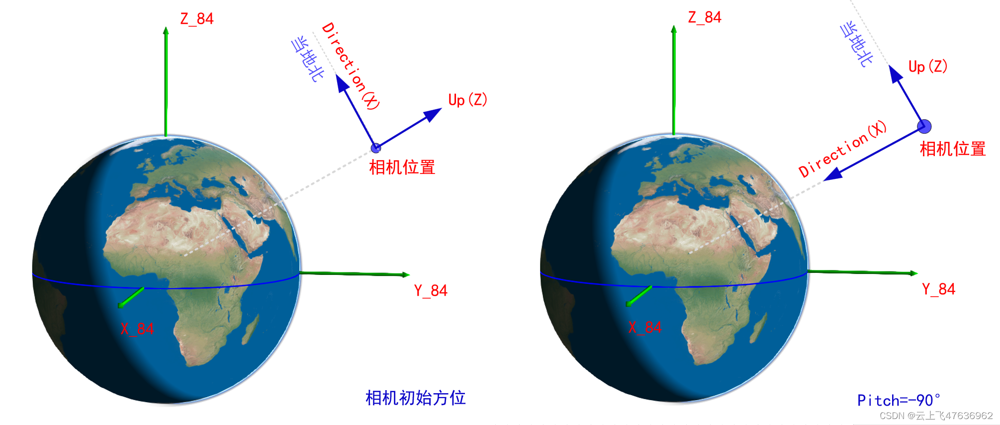
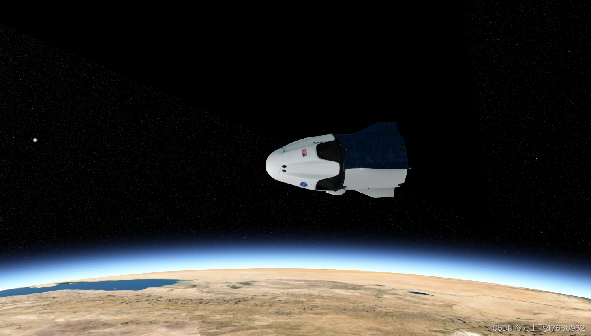
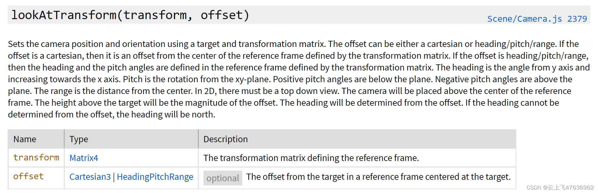
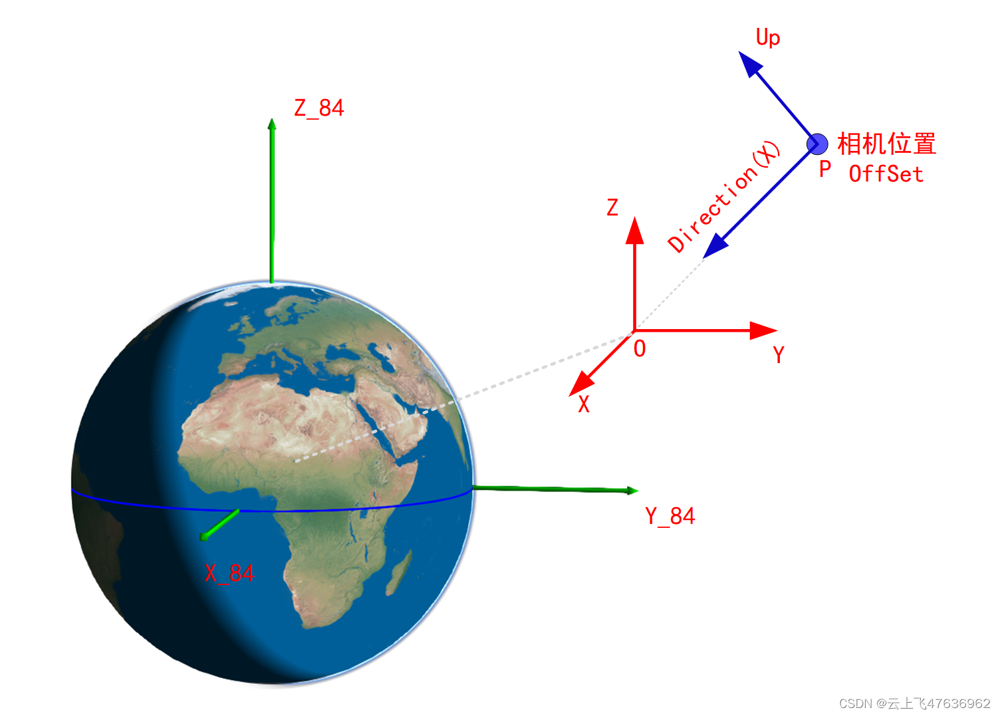
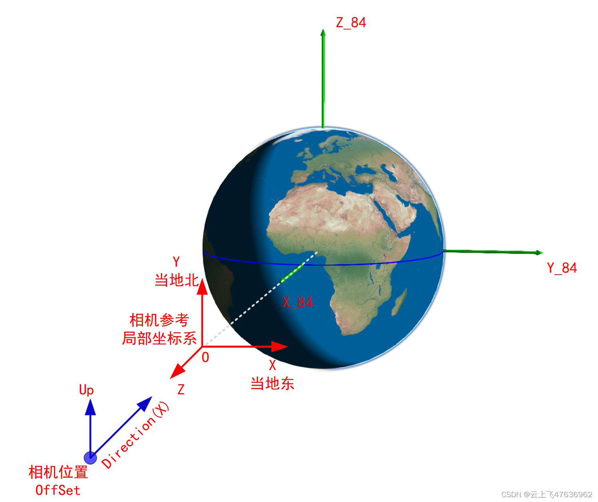

# Cesium中的相机---setView&lookAtTransform 

本文介绍了Cesium中用于控制相机视角的两个关键函数：SetView和lookAtTransform。SetView函数用于设置相机位置和方位，通过destination和orientation参数实现，包括Heading/Pitch/Roll三个角度的定义。lookAtTransform则允许相机始终朝向一个局部坐标系的原点，通过transform矩阵和offset参数来定位。示例代码展示了不同场景下如何运用这两个函数实现各种视角效果。
 

作为相机系列，此处先温习一下前期涉及到[Cesium] 中Camera的两个概念（系列文章可参考我前面发的"Cesium中的相机--"系列）。

### 1.回顾

#### 1.1 相机的空间位置

Cesium中，世界坐标系就是地球的WGS84系，也即地球固连坐标系（[Earth]，在此坐标中定义相机的位置与观测方位。

[相机坐标系]{.words-blog .hl-git-1 tit="相机坐标系"
pretit="相机坐标系"}见下图(使用Hubble望远镜示意相机)，在Camera对象中，通常用三个矢量来表示：Up、Right和Direction，这三个方向确定了相机的观测方位。Up、Right、Direction与相机坐标系（视图坐标系）XYZ三轴的关系为：\
X=Direction\
Y=Left\
Z=Up\


#### 1.2 Heading/Pitch/Roll的定义

在Cesium中，常使用Heading/Pitch/Roll三个参数来表示相机相对某坐标系的姿态：

-   Heading，表示相机绕Up轴旋转，Up轴为+Z轴，且定义绕-Z轴旋转为正。
-   Pitch，表示相机绕Right轴旋转，Right轴为-Y轴，且定义绕-Y轴旋转为正。
-   Roll，表示相机绕Direction轴（视线方向）旋转，Direction轴为+X轴，且绕+X轴旋转为正。\
    相机的三个旋转方向见下图示意，同时给出了Cesium中相机的Up/Right/Direction三个轴与X/Y/Z轴的关系。\
    

### 1.3 SetView

温顾了上述两个知识点，下面直接给出SetView的定义\
\
**Camera中的SetView函数用来设置相机的位置和方位的。**

相机位置由destination指定，通常使用三维笛卡尔坐标(Cartesian3)来确定，此坐标默认为世界坐标系（即WGS84系）下，显然，destination距离地球越远，则视场内地球越小。

相机的方位由orientaiton参数指定，有两种方式：1）HeadingPitchRoll三个参数；2）DirectionUp两个参数。

下图左图给出了Cesium中SetView函数时，相机的初始方位：

-   相机的视线(Direction)方向与当地北向重合
-   相机的上方向(Up)与当地天顶方向(地心-相机位置矢量方向)\
    

因此，基于相机的初始方位，可以使用HeadingPitchRoll三个参数来表示相机的具体方位，具体转换过程见上面有关HeadingPitchRoll的阐述。

简单举个例子，如果我们想要相机看向地心，那么为上图右图所示。可知，只要将相机从初始方位沿着Y轴旋转90°（对应的Pitch角度为-90°）即可。

当然，使用Direction和Up两个参数也可以指定相机的方位，简介明了，但是需要给出两个具体的矢量方向。

下面直接以代码给出几个示例：

```js
// 1. Top-Down视角。此处仅设置相机位置，函数内部将Pitch设置为-90°，实现向地心看的效果
viewer.camera.setView({
    destination : Cesium.Cartesian3.fromDegrees(-117.16, 32.71, 15000.0)
});

// 2 采用Heading,Pitch,roll参数 设置相机方位
viewer.camera.setView({
    destination :  Cesium.Cartesian3.fromDegrees(0, 0, 10000000),   //赤道上空1000km高度
    orientation: {
        heading : Cesium.Math.toRadians(90.0), // 相机方向指向当地东向
        pitch : Cesium.Math.toRadians(-90),    // 再将相机方向转向地心，此时Up方向指向当地东向
        roll : 0.0                             
    }
});

// 3. 采用Heading,Pitch,roll参数设置相机方位，相机位置没有设置，则采用原来的位置！
viewer.camera.setView({
   orientation: {
        heading : Cesium.Math.toRadians(90.0), // 相机方向指向当地东向
        pitch : Cesium.Math.toRadians(-90),    // 再将相机方向转向地心，此时Up方向指向当地东向
        roll : 0.0                             
    }
});


// 4. 相机位置使用矩形定义，相机方位为缺省设置（内部pitch=-90°），实现看地心效果
viewer.camera.setView({
    destination : Cesium.Rectangle.fromDegrees(west, south, east, north)
});

// 5. 使用direction和up矢量方向直接定义相机的方位
viewer.camera.setView({
    destination : Cesium.Cartesian3.fromDegrees(-122.19, 46.25, 5000.0),  // 相机的位置
    orientation : {
        direction : new Cesium.Cartesian3(-0.042312, -0.201232, -0.978629), //相机视线方向矢量(WGS84系下)
        up : new Cesium.Cartesian3(-0.479345, -0.855321, 0.1966022)         //相机的up方向矢量(WGS84系下)
    }
}); 
```

### 1.4 lookAtTransform

setView函数直接确定了相机在世界坐标系的位置，而且相机的方向可以任意指定。但是在Cesium中，我们常常有一种跟随对象的视角，也就是相机始终跟随运动的对象（如下图的飞行中的龙飞船）。鼠标无论怎么调整视角，相机的方向始终对着龙飞船，也就是说相机的参考系不再是世界坐标系了，而是飞船局部坐标系。\
\
lookAtTransform函数的定义见下图，它的主要功能是：设定一个局部的参考系，让相机始终朝着局部参考系的原点。\
\
在上面定义中，两个参数的说明如下，可结合下图来看。

-   transform是相机参考的局部坐标系到世界坐标系的齐次坐标转换矩阵(Matrix4)，通过此4×4的矩阵，可以把局部坐标系的位置直接转换到世界坐标系中（包含旋转和平移，详细参考另一篇文章：[Cesium中的相机---齐次坐标与坐标变换](https://blog.csdn.net/u011575168/article/details/84309699)）。此局部坐标系一般为地面某点的"east-north-up"坐标系或者运行的卫星轨道坐标系，见下图中的o-XYZ坐标系。
-   offset有两种类型，此处只讲一种：Cartesian3，即笛卡尔坐标，表示相机在局部坐标系中的位置，如下图中的OP矢量即表示相机的offset参数。
-   相机的位置有了，那么相机的方位如何确定？见下图：相机的方向，即Direction始终指向局部坐标系的中心；相机的Up方向约束在局部坐标系的Z方向。\
    \
    lookAtTransform的用途非常广泛，可以将相机设置为任何局部坐标系，而局部坐标是通过Matrix4矩阵表示。

下面直接以代码给出示例：

```js
//  在赤道上零经度上空一点，局部坐标系为:east-north-up坐标系，X:当地东向，Y:当地北向，Z:当地天顶方向，即世界坐标系的x方向
//  transform为局部坐标系到世界坐标系的齐次转换矩阵（包含旋转和平移）
const transform = Cesium.Transforms.eastNorthUpToFixedFrame(Cesium.Cartesian3.fromDegrees(0, 0, 10000000));
//  相机设置在局部坐标系的(0,0,1000)处，相机的视线方向指向局部坐标系零点，本例中，也就是从局部坐标系的Z轴向原点看，在世界坐标系下看就是向地心看
//  注意，由于此时视线方向与Z轴重合，所以程序内部将up方向设置为局部坐标系的Y方向，本例中也就是世界坐标系的Z方向。见下图示意。
var offset = new Cesium.Cartesian3(0, 0, 1000);
viewer.camera.lookAtTransform(transform, offset);
```

下图为上个例子的代码对应的示意图\
\
另一个例子就是地球惯性系的视角，也即地球在自转的效果，参见下面代码，这个也是Cesium官方给出的例子

```js
//  根据当前场景时间实时计算视角
//  此函数被注册到scene.preRender事件中
function icrf(scene, time) {
  // 不是3D窗口，直接返回
  if (scene.mode !== Cesium.SceneMode.SCENE3D) {
    return;
  }
  //  本例中，相机的局部坐标系就是地球惯性系,原点和世界坐标系重合，因此只有旋转，没有平移
  //  计算当前时刻，地球惯性系(icrf)到固定系(Fixed,也就是世界坐标系WGS84)的转换矩阵
  var icrfToFixed = Cesium.Transforms.computeIcrfToFixedMatrix(time);

  //  此处判断icrfToFixed是因为有可能上面代码返回为undefined
  if (Cesium.defined(icrfToFixed)) {
    // Maxtrix4形式，注意，此处没有平移，因为原点重合
    var transform = Cesium.Matrix4.fromRotationTranslation(icrfToFixed);
    // 当前相机的位置(相对局部坐标系的位置)
    var offset = Cesium.Cartesian3.clone(scene.camera.position);
    scene.camera.lookAtTransform(transform, offset);
  }
}

//  每次场景更新时都调用函数icrf调整视角
viewer.scene.preRender.addEventListener(icrf);
```

通过以上两个例子可知，我们只要提供了想要的局部坐标系到世界坐标系的齐次转换[矩阵](Matrix4形式)，那么就可以将相机局限在我们想要的局部坐标系中！！
